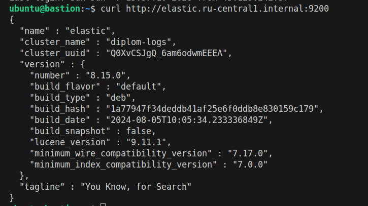
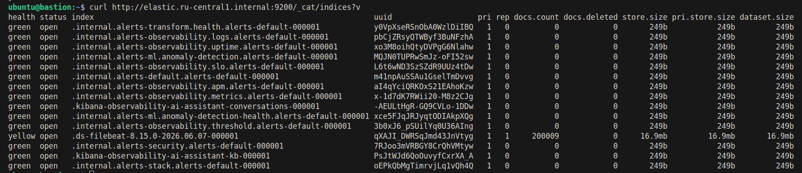

# Дипломное задание - Котов Александр

## Задание
<details>
<summary>Посмотреть задание</summary>
Ключевая задача — разработать отказоустойчивую инфраструктуру для сайта, включающую мониторинг, сбор логов и резервное копирование основных данных. Инфраструктура должна размещаться в [Yandex Cloud](https://cloud.yandex.com/) и отвечать минимальным стандартам безопасности: запрещается выкладывать токен от облака в git. Используйте [инструкцию](https://cloud.yandex.ru/docs/tutorials/infrastructure-management/terraform-quickstart#get-credentials).

**Перед началом работы над дипломным заданием изучите [Инструкция по экономии облачных ресурсов](https://github.com/netology-code/devops-materials/blob/master/cloudwork.MD).**

## Инфраструктура
Для развёртки инфраструктуры используйте Terraform и Ansible.  

Не используйте для ansible inventory ip-адреса! Вместо этого используйте fqdn имена виртуальных машин в зоне ".ru-central1.internal". Пример: example.ru-central1.internal  - для этого достаточно при создании ВМ указать name=example, hostname=examle !! 

Важно: используйте по-возможности **минимальные конфигурации ВМ**:2 ядра 20% Intel ice lake, 2-4Гб памяти, 10hdd, прерываемая. 

**Так как прерываемая ВМ проработает не больше 24ч, перед сдачей работы на проверку дипломному руководителю сделайте ваши ВМ постоянно работающими.**

Ознакомьтесь со всеми пунктами из этой секции, не беритесь сразу выполнять задание, не дочитав до конца. Пункты взаимосвязаны и могут влиять друг на друга.

### Сайт
Создайте две ВМ в разных зонах, установите на них сервер nginx, если его там нет. ОС и содержимое ВМ должно быть идентичным, это будут наши веб-сервера.

Используйте набор статичных файлов для сайта. Можно переиспользовать сайт из домашнего задания.

Виртуальные машины не должны обладать внешним Ip-адресом, те находится во внутренней сети. Доступ к ВМ по ssh через бастион-сервер. Доступ к web-порту ВМ через балансировщик yandex cloud.

Настройка балансировщика:

1. Создайте [Target Group](https://cloud.yandex.com/docs/application-load-balancer/concepts/target-group), включите в неё две созданных ВМ.

2. Создайте [Backend Group](https://cloud.yandex.com/docs/application-load-balancer/concepts/backend-group), настройте backends на target group, ранее созданную. Настройте healthcheck на корень (/) и порт 80, протокол HTTP.

3. Создайте [HTTP router](https://cloud.yandex.com/docs/application-load-balancer/concepts/http-router). Путь укажите — /, backend group — созданную ранее.

4. Создайте [Application load balancer](https://cloud.yandex.com/en/docs/application-load-balancer/) для распределения трафика на веб-сервера, созданные ранее. Укажите HTTP router, созданный ранее, задайте listener тип auto, порт 80.

Протестируйте сайт
`curl -v <публичный IP балансера>:80` 

### Мониторинг
Создайте ВМ, разверните на ней Zabbix. На каждую ВМ установите Zabbix Agent, настройте агенты на отправление метрик в Zabbix. 

Настройте дешборды с отображением метрик, минимальный набор — по принципу USE (Utilization, Saturation, Errors) для CPU, RAM, диски, сеть, http запросов к веб-серверам. Добавьте необходимые tresholds на соответствующие графики.

### Логи
Cоздайте ВМ, разверните на ней Elasticsearch. Установите filebeat в ВМ к веб-серверам, настройте на отправку access.log, error.log nginx в Elasticsearch.

Создайте ВМ, разверните на ней Kibana, сконфигурируйте соединение с Elasticsearch.

### Сеть
Разверните один VPC. Сервера web, Elasticsearch поместите в приватные подсети. Сервера Zabbix, Kibana, application load balancer определите в публичную подсеть.

Настройте [Security Groups](https://cloud.yandex.com/docs/vpc/concepts/security-groups) соответствующих сервисов на входящий трафик только к нужным портам.

Настройте ВМ с публичным адресом, в которой будет открыт только один порт — ssh.  Эта вм будет реализовывать концепцию  [bastion host]( https://cloud.yandex.ru/docs/tutorials/routing/bastion) . Синоним "bastion host" - "Jump host". Подключение  ansible к серверам web и Elasticsearch через данный bastion host можно сделать с помощью  [ProxyCommand](https://docs.ansible.com/ansible/latest/network/user_guide/network_debug_troubleshooting.html#network-delegate-to-vs-proxycommand) . Допускается установка и запуск ansible непосредственно на bastion host.(Этот вариант легче в настройке)

Исходящий доступ в интернет для ВМ внутреннего контура через [NAT-шлюз](https://yandex.cloud/ru/docs/vpc/operations/create-nat-gateway).

### Резервное копирование
Создайте snapshot дисков всех ВМ. Ограничьте время жизни snaphot в неделю. Сами snaphot настройте на ежедневное копирование.
</details>

---

## Решение

### Архитектура инфраструктуры

Инфраструктура развёрнута в одной VPC и разделена на публичный и приватный контуры.

### Публичный контур

В публичной подсети размещены:

- **bastion host** — сервер для SSH-доступа во внутренний контур;
- **Zabbix** — сервер мониторинга;
- **Kibana** — веб-интерфейс для просмотра логов;
- **Application Load Balancer** — публичная точка входа на сайт.

### Приватный контур

В приватных подсетях размещены:

- **web-1** — первый веб-сервер nginx;
- **web-2** — второй веб-сервер nginx;
- **Elasticsearch** — сервер для хранения логов.

Веб-серверы и **Elasticsearch** не имеют внешних IP-адресов. Доступ к ним выполняется через bastion host и внутренние FQDN:

```text
web-1.ru-central1.internal
web-2.ru-central1.internal
elastic.ru-central1.internal
```

### Балансировка нагрузки

Для отказоустойчивой работы сайта были созданы две виртуальные машины с nginx в разных зонах.  

Настроены следующие компоненты:

- Target Group с двумя web-серверами;
- Backend Group с HTTP health check;
- HTTP Router;
- Application Load Balancer;
- HTTP listener на порту `80`.

Сам сайт доступен по ссылке:
```text
АДРЕС АБЛ
```

### Ansible

**Zabbix, elasticsearch, kibana. filebeat, nginx** установлены и настроены с помощью соответствующих playbook'ов. При настройке использованы FQDN. 

### Zabbix

На отдельной виртуальной машине установлен **Zabbix server**

На все виртуальные машины установлен **Zabbix Agent**

Настроен кастомный дашборд с отображением Load average, использованием памяти и диска.

**Zabbix** доступен с дефолтными учетными данными по адресу:
```text
АДРЕС ЗАБИКСА
```

### Логи

Для сбора логов был развёрнуты **Felibeat**, **Elasticsearch** и **Kibana**

**Elasticsearch** установлен на отдельной ВМ `elastic` и доступен по внутреннему адресу:


```text
http://elastic.ru-central1.internal:9200
```
<details>
<summary>curl elastic</summary>


</details>
<br>

**Filebeat** установлен на **web-1** и **web-2**, собирает журналы nginx

<details>
<summary>curl filebeat</summary>


</details>
<br>

**Kibana** установлена на отдельной ВМ и подключена к **Elasticsearch**

Доступ к **Kibana** осуществляется по ссылке:

```text
## Вписать адрес кибаны
```


## Резервное копирование

Для резервного копирования настроено ежедневное создание снапшотов всех виртуальных машин в 2 часа ночи. Снапшоты хранятся 7 дней

В резервное копирование включены диски:

- `bastion`;
- `web-1`;
- `web-2`;
- `zabbix`;
- `elastic`;
- `kibana`.